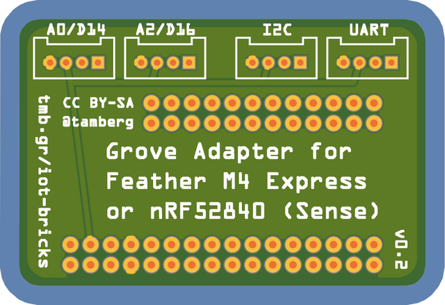

# Adapter_M4_v0.2

## Order
* Create an account at https://aisler.net/
* Go to https://aisler.net/tamberg/fhnw-iot-bricks/adapter_m4_v0-2
* Checkout to order the board (~EUR 27 for 9 PCBs plus shipping to Switzerland)

## Workflow
### Fritzing
* Install Fritzing from https://fritzing.org/
* Select PCB view
* Use Proto Featherwing footprint
* Use Grove module foorprint
	* variant 4
* Use Core > Connection > Generic Header
	* pins 24 and 32, spacing 2.54 mm, row double
* Place header according to Feather footprint, then remove it
* Select the board, note its size (in mm)
* Use OpenScad (optional, see steps below) to design an SVG board outline
* Use load image file to load the SVG board outline

### Aisler (or any PCB fab)
* Create an account at https://aisler.net/
* Create a project repository
* Import a project, i.e. a Fritzing file
* Open the board inspector, check everything
* Checkout to order the board

### OpenScad
* Install OpenScad from https://openscad.org/
* Design a board outline according to the noted size
* Render the design to enable exporting it
* Export the 2D design as SVG
* Edit the SVG file manually (based on [this video](https://www.youtube.com/watch?v=ydcOzbCJltg
))
    * Enclose the `<path .../>` section(s) in a `<g>...</g>`
    * Set the `id` to `board`
    * Set the `stroke` to `none`
    * Set the `stroke-width` to `0`
* Copy the whole `<g>...</g>` element
    * Set the copy's `id` to `silkscreen`
    * Set its `stroke` to `black`
    * Set its `fill` to `none`
    * Set its `stroke-width` to `0.203`
* The result should look like this<pre>
	&lt;svg&gt;...
        &lt;g id="board"&gt;&lt;path d="..." stroke="none" fill="lightgray" stroke-width="0"/>&lt;/g&gt;
        &lt;g id="silkscreen">&lt;path d="..." stroke="black" fill="none" stroke-width="0.203"/&gt;&lt;/g&gt;
    &lt;/svg&gt;</pre>
