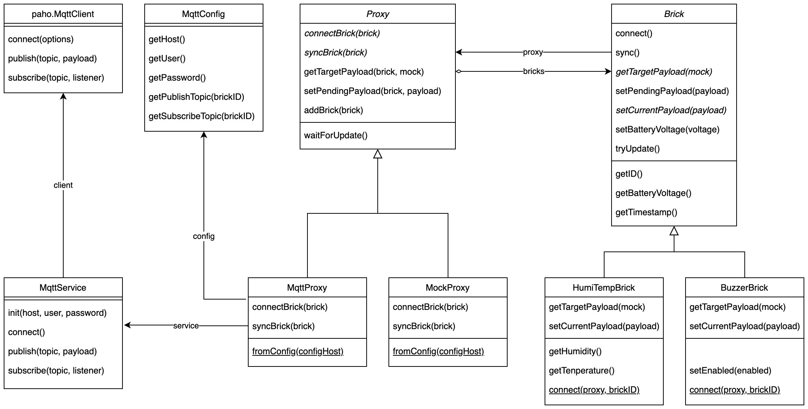

# FHNW IoT Bricks
> Work in progress. Interested? Contact thomas.amberg@fhnw.ch
## Building blocks for distributed IoT use cases
IoT Bricks enable IoT prototyping in a room, building or city.
## Simple, self-contained, connected
IoT Bricks come with connectivity and a simple Java SDK.
## Hardware example


[IoT Brick Temperature](https://www.thingiverse.com/thing:3638252) on Thingiverse.

## Software example
### Interface
```
public abstract class Brick {
    public String getID();
    public double getBatteryVoltage();
    public Date getTimestamp();
    public String getTimestampIsoUtc();
}

public final class ButtonBrick extends Brick {
    public boolean isPressed();
    public static ButtonBrick connect(Proxy proxy, String brickID);
}

public final class BuzzerBrick extends Brick {
    public void setEnabled(boolean enabled);
    public static BuzzerBrick connect(Proxy proxy, String brickID);
}

public final class LedBrick extends Brick {
    public void setColor(Color value);
    public static LedBrick connect(Proxy proxy, String brickID);
}

public final class HumiTempBrick extends Brick {
    public double getHumidity();
    public double getTemperature();
    public static HumiTempBrick connect(Proxy proxy, String brickID);
}

public final class DisplayBrick extends Brick;
    public void setDecimalPlaces(int value);
    public void setDoubleValue(double value);
    public static DisplayBrick connect(Proxy proxy, String brickID);
}

public abstract class Proxy {
    public final void waitForUpdate();
}

public final class MqttProxy extends Proxy {
    public static MqttProxy fromConfig(String configBaseURI);
}     

public final class MockProxy extends Proxy {
    public static MockProxy fromConfig(String configBaseURI);
}
```
### Config
```
final String BASE_URI = "brick.li"; // the registry has a base URI
final String BRICK_ID = "0000-0001"; // each brick has a unique ID
```
### Shared Proxy
```
Proxy proxy = MqttProxy.fromConfig(BASE_URI);
// or proxy = MockProxy.fromConfig(BASE_URI);
```
### Monitoring System
```
HumiTempBrick humiTempBrick = HumiTempBrick.connect(proxy, HUMITEMP_BRICK_ID);
DisplayBrick displayBrick = DisplayBrick.connect(proxy, DISPLAY_BRICK_ID);
ColorLedBrick colorLedBrick = ColorLedBrick.connect(proxy, COLORLED_BRICK_ID);

while (true) {
    double temp = humiTempBrick.getTemperature();
    displayBrick.setDoubleValue(temp);
    Color color = temp > 23 ? Color.RED : Color.GREEN;
    colorLedBrick.setColor(color);
    proxy.waitForUpdate();
}
```

### Logging System
```
HumiTempBrick humiTempBrick = HumiTempBrick.connect(proxy, HUMITEMP_BRICK_ID);
FileWriter fileWriter = null;
try {
    fileWriter = new FileWriter("log.csv", true); // append
} catch (IOException e) {
    e.printStackTrace();
}

while (true) {
    double temp = humiTempBrick.getTemperature();
    String time = humiTempBrick.getTimestampIsoUtc();
    try {
        fileWriter.append(time + ", " + temp + "\n");
        fileWriter.flush();
    } catch (IOException e) {
        e.printStackTrace();
    }
    proxy.waitForUpdate();
}
```

### Door Bell
```
ButtonBrick buttonBrick = ButtonBrick.connect(proxy, BUTTON_BRICK_ID);
BuzzerBrick buzzerBrick = BuzzerBrick.connect(proxy, BUZZER_BRICK_ID);

while (true) {
    boolean pressed = buttonBrick.isPressed();
    buzzerBrick.setEnabled(pressed);
    proxy.waitForUpdate();
}
```

## Software architecture
### Class diagram
<table><tr><td></td></tr></table>
