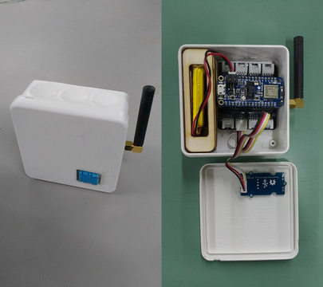

# FHNW IoT Bricks
> Work in progress. Interested? Contact thomas.amberg@fhnw.ch
## Building blocks for distributed IoT use cases
IoT Bricks enable IoT prototyping in a room, building or city.
## Simple, self-contained, connected
IoT Bricks come with long range connectivity and a simple SDK.
## Hardware example


## Software example
### Interface
```
public final class Backend {
    // Config
    public static void setHost(String host);
    public static void setUser(String user);
    public static void setPassword(String password);
    // Bricks
    public static ButtonBrick createButtonBrick(String token);
    public static LcdDisplayBrick createLcdDisplayBrick(String token);
    public static LedBrick createLedBrick(String token);
    public static LedStripBrick createLedStripBrick(String token);
    public static TemperatureBrick createTemperatureBrick(String token);
}

public enum UpdateFrequency { LOW, MEDIUM, HIGH }

public enum UpdateMode { LIVE, DEMO, MIXED }
 
public abstract class Brick {
    public int getBatteryLevel();
    public UpdateFrequency getUpdateFrequency();
    public void setUpdateFrequency(UpdateFrequency frequency);
    public static UpdateMode getUpdateMode();
    public static void setUpdateMode(UpdateMode mode);
    public DateTime getLastUpdateTimestamp();
}

public final class ButtonBrick extends Brick {
    public boolean getPressed();
}

public final class LedPixelBrick extends Brick {
    public void setColor(Color value);
}

public final class LedStripBrick extends Brick {
    public void setColors(Color[] values);
}

public final class LcdDisplayBrick extends Brick {
    public void setValue(double value);
}

public final class TemperatureBrick extends Brick {
    public double getHumidity();
    public double getTemperature();
}
```
### Backend Config
```
Backend.setHost("FHNW_IOT_BRICKS_HOST");
Backend.setUser("FHNW_IOT_BRICKS_USER");
Backend.setPassword("FHNW_IOT_BRICKS_PASSWORD");
```
### Monitoring System
```
TemperatureBrick tempBrick = Backend.createTemperatureBrick("TOKEN_PRINTED_ON_TEMP_BRICK");
LcdDisplayBrick displayBrick = Backend.createLcdDisplayBrick("TOKEN_PRINTED_ON_DISPLAY_BRICK");

while (true) {
    double temp = tempBrick.getTemperature();
    displayBrick.setValue(temp);
    TimeUnit.MINUTES.sleep(1);
}
```

### Door Bell
```
ButtonBrick buttonBrick = Backend.createButtonBrick("TOKEN_PRINTED_ON_TEMP_BRICK");
LedBrick ledBrick = Backend.createLedBrick("TOKEN_PRINTED_ON_DISPLAY_BRICK");

while (true) {
    if (buttonBrick.getPressed()) {
        ledBrick.setColor(Color.Red);
    } else {
        ledBrick.setColor(Color.Black);
    }
}
```
